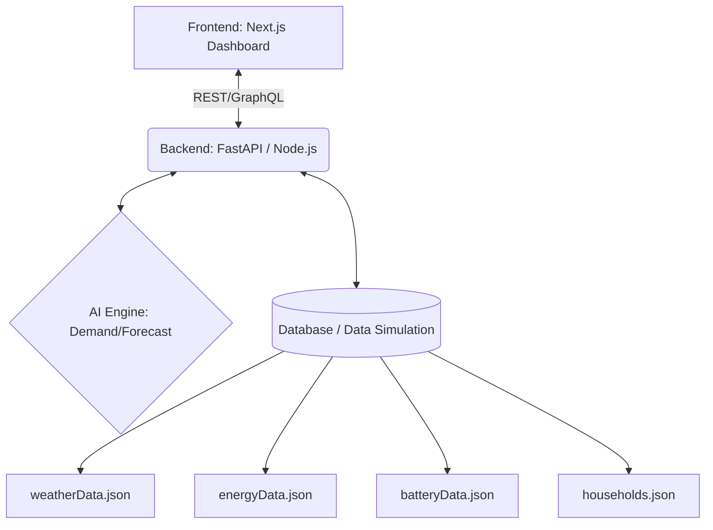

# GridFlow AI

## Problem Statement
Modern energy grids face unprecedented challenges with the rise of decentralized renewable energy sources and electric vehicle adoption. Managing peak demand, minimizing transmission losses, and ensuring grid stability requires intelligent, real-time load balancing and forecasting.

## Features
- **Real-Time Data Simulation**: Mock data generation for households, weather, batteries, and grid energy flow.
- **AI-Powered Demand Forecasting**: Predicts peak consumption and solar generation.
- **Smart Battery Management**: Automated energy transfer recommendations between storage nodes.
- **Interactive Dashboard**: Visualizes grid health, battery levels, and energy distribution.

## Architecture Diagram



## Tech Stack
- **Frontend**: Next.js, React, TailwindCSS
- **Backend**: FastAPI (Python) / Node.js
- **AI/ML Engine**: Python, Scikit-learn / TensorFlow
- **Data**: JSON Mock Databases

## Setup Instructions

1. **Clone the repository**:
   ```bash
   git clone <GITHUB_REPOSITORY_URL>
   cd gridflow-ai
   ```

2. **Frontend Setup**:
   ```bash
   cd frontend
   npm install
   npm run dev
   ```

3. **Backend Setup**:
   ```bash
   cd backend
   python -m venv venv
   source venv/bin/activate  # On Windows use `venv\Scripts\activate`
   pip install -r requirements.txt
   uvicorn main:app --reload
   ```

## API Endpoints (Proposed)
- `GET /api/v1/energy`: Retrieve current grid status
- `GET /api/v1/batteries`: Retrieve battery states
- `GET /api/v1/households`: Retrieve household consumption profiles
- `POST /api/v1/recommend`: Generate an AI energy transfer recommendation

## Demo Flow
1. **Initialize Data**: Load mock data into the AI model.
2. **Forecast**: AI predicts an incoming deficit in the residential sector.
3. **Recommend**: The engine suggests transferring 15 kWh from an industrial reserve battery.
4. **Visualize**: The dashboard updates to reflect the stable grid after the simulated transfer.

## Future Improvements
- Implement live weather API integrations.
- Train predictive models on real-world Smart Grid datasets.
- Add multi-tenant support for different regional grids.
